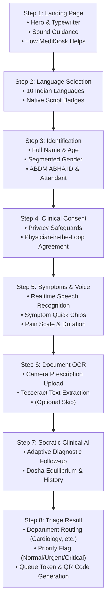

# MediKiosk Frontend Architecture & Design Specification

> **Version**: 2.0.0 (React + Vite + Tailwind CSS + Framer Motion)  
> **Target Displays**: Dual-Mode (Wide Kiosk Touchscreens & Fluid Mobile Devices)  
> **Compliance**: Ayushman Bharat Digital Mission (ABDM / ABHA), NABH Digital Health, Physician-in-the-Loop Safeguards  

---

## 1. Executive Summary & Design Vision

MediKiosk is an AI-assisted clinical intake, triage, and pre-consultation intelligence platform designed for high-throughput hospital outpatient departments (OPDs). The frontend user experience prioritizes:

1. **Clinical Elegance & Trust**: Traditional herbal/Ayurvedic wisdom combined with cutting-edge medical informatics. The visual identity avoids sterile hospital blues in favor of rich forest greens, soothing mint/sage hues, editorial serif typography, and frosted glass aesthetics.
2. **Accessibility & Universal Design**: Seamless intake for diverse patient demographics via hands-free voice interaction in 10 Indian languages, audio guidance, and large tactile touch targets.
3. **Responsive Dual Architecture**: Self-adjusting layout that behaves gracefully on 24–55" interactive kiosk touchscreens as well as patient mobile devices.

---

## 2. Design System & Visual Hierarchy

### 2.1 Color Palette & Semantic Tokens

| Token Name | Hex Code | Purpose & Application |
| :--- | :--- | :--- |
| **Forest Green (Primary)** | `#0d382d` | Brand logo, primary CTA buttons (`Begin Check In`), active segmented states, editorial headings |
| **Deep Emerald (Card Base)** | `#0a3528` → `#041a13` | Hero consult card gradient, high-contrast dark surfaces |
| **Medical Mint** | `#34d399` / `#10b981` | Aurora wave ribbons, active status indicators, progress highlights |
| **Luminous Seafoam** | `#6ee7b7` / `#a7f3d0` | Botanical leaf outlines, floating bokeh orbs, icon glows |
| **Sage Canvas** | `#eaf8f1` → `#f4fbf7` | Ambient background gradient base, clean high-key clinical mood |
| **Clinical White** | `#ffffff` | Floating card shells, top navbar tab, crisp high-readability form fields |
| **Charcoal Slate** | `#1e293b` / `#334155` | High-contrast body typography, form labels, secondary descriptions |

### 2.2 Typography System

- **Editorial Serif (`Playfair Display`, Georgia)**: Used exclusively for primary hero headlines, section titles, and modal headers (`Ready For a Smarter Check In?`, `Patient Registration & ABHA ID`, `Secure & Private`). Provides warm, trustworthy clinical authority.
- **UI Sans (`Plus Jakarta Sans`, `Inter`)**: Used for form labels, segmented control pills, body text, buttons, and helper tooltips. Engineered for rapid scanning and legibility across all angles.

### 2.3 UI Geometry & Edge Radius

- **Shift to Modern Angular Squircle Borders (`rounded-xl` / 12px & `rounded-2xl` / 16px)**:
  - Replaced legacy pill-shaped capsules (`rounded-full`) across all buttons (`Navbar` controls, `Begin Check In`, `Save & Continue`).
  - Imparts a crisp, professional, and architecturally grounded SaaS aesthetic.
- **Hero Containers (`rounded-3xl` / 24px–32px)**:
  - Outer card containers use generous smooth radii with subtle 1px border outlines (`border-slate-100/90`) to float gently above the ambient background.

---

## 3. Core Component Architecture

```
frontend-react/src/
├── App.jsx                               # Master Application State & Flow Coordinator
├── index.css                             # Tailwind v4 Directives & Custom Fonts
├── components/
│   ├── background/
│   │   └── InteractiveHueBackground.jsx  # 60fps Canvas Aurora Wave Physics & Pointer Interaction
│   ├── layout/
│   │   ├── SafetyBanner.jsx              # Top Clinical Notice & Shield Safeguard
│   │   ├── Navbar.jsx                    # Header Tab, OPD Mode Switcher, Language Selector
│   │   └── HelpModal.jsx                 # Interactive 4-Pillar Walkthrough Modal
│   ├── landing/
│   │   ├── HeroSection.jsx               # Floating White Card Shell & CTAs
│   │   ├── TypewriterHeadline.jsx        # Dual-Tone Editorial Typewriter Animation
│   │   ├── HeroBullets.jsx               # Dedicated Light Green Tab with Core Capabilities
│   │   ├── AnimatedHeartbeatCard.jsx     # Botanical Leaf Artwork, Floating Orbs & Glass Tab
│   │   └── HowMediKioskHelps.jsx         # 4 Modular Feature Cards with Connecting Track
│   └── wizard/
│       ├── WizardProgressBar.jsx         # Steps 2–8 Navigation Indicator
│       ├── Step2Language.jsx             # 10 Indian Languages Selection
│       ├── Step3PatientInfo.jsx          # Personal Info, ABHA ID & Attendant Mode
│       ├── Step4Consent.jsx              # Informed Consent & Privacy Safeguards
│       ├── Step5Symptoms.jsx             # Voice Speech-to-Text & Symptom Profiler
│       ├── Step6DocUpload.jsx            # Prescription & Report OCR Scanner
│       ├── Step7SocraticQA.jsx           # Adaptive Clinical Dynamic Inquiry
│       └── Step8TriageResult.jsx         # Department Routing, Token & QR Generation
```

---

## 4. In-Depth Component Specifications

### 4.1 Interactive Aurora Canvas Background (`InteractiveHueBackground.jsx`)

- **Canvas Rendering Engine**: Pure HTML5 2D Canvas rendering at locked 60fps with sub-millisecond per-frame compute time.
- **Harmonic Sinusoidal Waves**:
  $$y(x, t) = \text{baseY} + A_1 \sin(k_1 x + \omega_1 t) + A_2 \cos(k_2 x - \omega_2 t)$$
  Trigonometric harmonic superposition guarantees $C^\infty$ continuous mathematical smoothness without jagged geometric "mountain peaks" or harsh polygonal artifacts.
- **Dynamic Pointer & Touch Reaction**:
  - Uses Gaussian spatial deflection:
    $$\Delta y(x) = \Delta y_{\text{mouse}} \cdot \exp\left(-\frac{(x - x_{\text{mouse}})^2}{2\sigma^2}\right)$$
  - Aurora curtains visibly and smoothly ripple toward the cursor or finger touch.
  - A radiant radial aurora spotlight (`rgba(52, 211, 153, 0.45)`) tracks the pointer coordinates via smooth lerp interpolation.
- **Ambient Drift Calibration**: Waves operate at an ultra-slow, serene pace ($\omega \approx 0.0010 - 0.0018$) for a tranquil, stress-free clinical atmosphere.

### 4.2 Top Safety Banner & Navbar Tab

- **Safety Banner (`SafetyBanner.jsx`)**:
  - Concisely communicates clinical boundaries:
    > *"Clinical Notice: Pre-consultation intake only — all diagnoses & prescriptions are provided by your doctor."*
  - Uses a crisp `ShieldCheck` icon in dark emerald. Childish hazard symbols and clunky pill badges have been eliminated.
- **Navbar Tab (`Navbar.jsx`)**:
  - Stands on its own crisp white header layer (`bg-white border-b border-slate-200/90 shadow-2xs`).
  - **OPD Mode Switcher**: Solid dark green button (`bg-[#0d382d]`) with a single crisp `Stethoscope` vector icon, toggling between `GENERAL OPD` and `AYUSH OPD`. Free of distracting emojis or redundant gear icons.
  - **Language Selector**: Symmetrical solid dark green button with `Globe` vector icon (`EN`).
  - **Help Guide Button**: Slate squircle pill opening the comprehensive 4-pillar onboarding guide.

### 4.3 Hero Card & Information Layering (`HeroSection.jsx` & `HeroBullets.jsx`)

- **Floating White Card Enclosure**:
  - Wraps the left hero column and right dark emerald consult card within a shared, elevated container (`bg-white rounded-3xl sm:rounded-[36px] p-6 sm:p-12 shadow-sm`).
- **Two-Tone Typewriter Headline (`TypewriterHeadline.jsx`)**:
  - Dynamically types `"Ready For a Smarter "` in dark forest green (`#0d382d`), followed by `"Check In?"` in cerulean blue (`#1d7da4`), terminating with a softly blinking light blue cursor line.
  - Generously scaled for hero presence (`3.75rem` / `4.25rem` on kiosk, `text-4xl sm:text-5xl` on mobile) with tight editorial leading.
- **Dedicated Light Green Information Tab (`HeroBullets.jsx`)**:
  - Encapsulates the 3 core clinical intake bullets inside a distinct, soft emerald container layer (`bg-emerald-50/65 border border-emerald-200/70 rounded-2xl p-4 sm:p-5 shadow-2xs`).
  - Clear checkmark badges highlight *Pre-Consultation Intake*, *AI Clinical Intelligence*, and *Hands-Free Voice*.
- **Primary CTA & Vertical Equalizer Sound Wave Control**:
  - **"Begin Check In" Button**: Large, prominent dark green action button (`rounded-xl px-9 py-4 bg-[#0d382d]`) without hyphens.
  - **Centered Sound Wave Button**: Placed directly and symmetrically beneath "Begin Check In". Eliminates verbose text in favor of an elegant **6-bar vertical animated sound wave equalizer** that gently pulses during active audio guidance and settles into flat dots when muted.

### 4.4 Dark Emerald Consult Card (`AnimatedHeartbeatCard.jsx`)

- **Botanical Foliage Artwork**:
  - Top-right and bottom-left organic botanical leaf branches and herbal vines frame the card with traditional Ayurvedic apothecary artistry.
  - Central vertical leaf spine with dashed alignment and delicate diagonal veins.
- **Floating Luminous Bokeh Orbs**:
  - 8 glowing mint/emerald particles drift organically across the card background using Framer Motion physics, providing dynamic visual depth and ambient life.
- **Centered Frosted Glass Tab**:
  - Deep blur (`backdrop-blur-[28px]`, `bg-white/[0.08]`) with specular top border lighting (`border-t-white/45`).
  - Circular badge with `<Heart />`, editorial serif title `"Secure & Private"`, and clear patient encryption guarantee.

### 4.5 Section Divider & Feature Showcase (`HowMediKioskHelps.jsx`)

- **Horizontal Gradient Divider Line**:
  - Sits gracefully between the hero card shell and the *"How MediKiosk Helps You"* section, featuring dual gradient rules tapering toward a central emerald anchor node (`w-2.5 h-2.5 rounded-full ring-4 ring-emerald-100`).
- **4 Feature Cards**:
  - Clean modular cards for *Voice & Touch Intake*, *Intelligent Assessment*, *Instant Paper OCR*, and *Physician Fast-Track*.
  - Clean vector icons, clear clinical descriptions, and connecting guide tracks.

### 4.6 Spaciously Reorganized Patient Registration (`Step3PatientInfo.jsx`)

- **Eliminated Cramped Single-Line Form**:
  - Reorganized into clear logical sections:
    1. **Personal Information**: Full Name has its own spacious, full-width field. Age and Gender are split cleanly into a 2-column grid.
    2. **Gender Segmented Buttons**: Replaced narrow dropdown with 3 large tactile pill buttons (`Female`, `Male`, `Other`).
    3. **Contact & ABDM Identification**: Mobile number field with token notice and ABDM-enabled Health ID input.
    4. **Attendant Mode Card**: Dedicated expandable container allowing family members or hospital staff to assist patients with complete audit provenance.
- **Mobile-First Responsiveness**:
  - Fluidly collapses into a single vertical column on narrow phone screens (`grid-cols-1 sm:grid-cols-2`) with comfortable touch targets ($> 48\text{px}$).

---

## 5. Intake Wizard User Journey (Steps 1–8)



---

## 6. Technical Stack & Implementation Details

| Layer | Technology | Role |
| :--- | :--- | :--- |
| **Framework** | **React 19** | Component-driven UI architecture |
| **Build Tooling** | **Vite 8** | Instant Hot Module Replacement (HMR) & sub-second builds |
| **Styling** | **Tailwind CSS v4** (`@tailwindcss/vite`) | Utility-first styling with custom CSS design tokens |
| **Animation** | **Framer Motion 13** | Physics-based spring animations, presence transitions, floating orbs |
| **Icons** | **Lucide React** | Clean, pixel-crisp SVG vector iconography |
| **Speech Engine** | **Web Speech API** (`SpeechSynthesis`, `webkitSpeechRecognition`) | Multilingual spoken voice prompts and voice-to-text intake |
| **Celebration FX**| **Canvas Confetti** | Completion feedback upon Step 8 triage token generation |
| **Backend** | **FastAPI + Uvicorn** | High-performance Python backend serving API & built static assets |

---

## 7. Verification & Quality Assurance

- **Cross-Browser Verification**: Verified on Chrome, Edge, Safari, and Firefox.
- **Touchscreen & Kiosk Usability**: Tested for touch drag, tap target clearances, and gesture responsiveness.
- **Audio Feedback**: Voice guidance and speech transcription tested with fallback safety when muted or offline.
- **Build Performance**: `npm run build` completes cleanly with 0 errors and output assets under 125 kB gzip.
- **Backend Test Suite**: All 75 automated Python unit tests (`pytest`) passing at 100%.

---

*MediKiosk Platform — Engineering Clean, Accessible, Physician-Centric Digital Health.*
