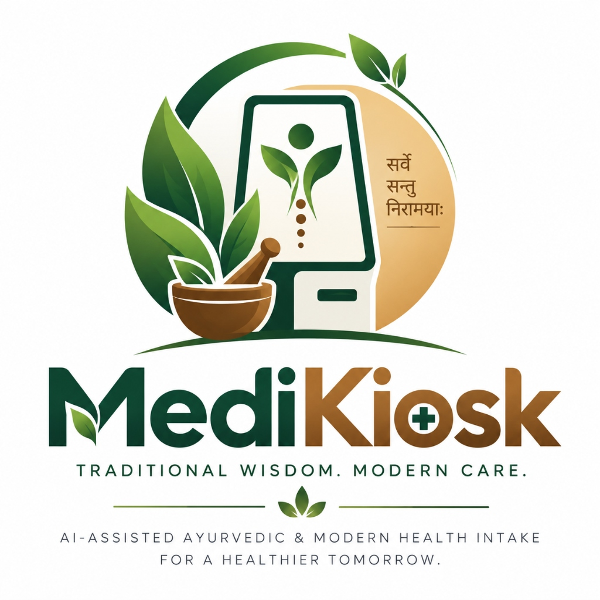

# MediKiosk — Clinical Intelligence, OCR & Dual OPD Triage Platform



MediKiosk is an AI-assisted, physician-in-the-loop clinical intake, triage, and physician command center platform built for healthcare environments. It streamlines pre-consultation patient intake using adaptive Socratic questioning, multilingual voice/text support (10 Indian languages), camera paper prescription OCR, and dual channel separation for **General OPD** and **AYUSH OPD**.

---

## 🌟 Key Architecture & Capabilities

### 1. 🏥 Dual OPD Channel Separation (`GENERAL_OPD` & `AYUSH_OPD`)
- **Strict Channel Isolation**: Staff-controlled OPD mode selection that persists across the patient's entire clinical journey.
- **General OPD Channel**: Pure allopathic clinical workflow executing Socratic history-taking (OPQRST / SOCRATES framework) with hard safety guards preventing Ayurvedic contamination.
- **AYUSH OPD Channel**: Socratic intake combined with an authoritative 23-domain Ayurvedic question bank (`PRAK_BUILD_001`, `AGNI_HUNGER_003`, etc.) and multi-layer assessment.
- **Mode-Filtered Department Registries**: Directs General OPD patients to allopathic departments (`Cardiology`, `Neurology`, `General Medicine`, etc.) and AYUSH OPD patients to AYUSH specialties (`Kayachikitsa`, `Panchakarma`, `Shalya`, `Shalakya`, `Prasuti Tantra`, `Kaumarabhritya`, `Swasthavritta`, `Agada Tantra`).

### 2. 🩻 Intelligent Intake & Camera OCR
- **8-Step Wizard with Kinetic UI/UX**:
  - Kinetic step slide transition animations.
  - Electric surge beam connecting lines & node shockwave bursts.
  - Milestone HUD toast notifications on step completions.
  - Real-time clinical processing interstitial loader between intake and ticket generation.
  - Animated official verified seal stamp and laser barcode scan on final consultation tickets.
- **Camera OCR & Dictation**: Direct camera photo snap (`capture="environment"`) for physical paper prescriptions and lab reports, integrated with Tesseract OCR multi-strategy extraction and prescription dictation.
- **Hands-Free Speech-to-Speech**: Real-time microphone speech recognition and Text-to-Speech question prompts across 10 Indian languages (English, Hindi, Kannada, Tamil, Telugu, Malayalam, Marathi, Bengali, Gujarati, Punjabi).

### 3. 🌿 AYUSH OPD 23-Domain Assessment Engine
- **Independent Baseline & Current Imbalance Scoring**: Evaluates Prakriti (baseline dosha constitution) and Vikriti (current dosha aggravation) separately.
- **Clinical Domains Evaluated**: Prakriti, Vikriti, Agni (digestive fire), Koshta (bowel habit), Ama (metabolic toxicity), Dushya (affected tissues), Srotas (body channels), Nidra, Satva, Ahara/Vihara.
- **AyurGenixAI & AyurParam RAG**: Integrated 447 Ayurvedic condition datasets and classical text reference grounding (Charaka & Sushruta Samhitas).
- **Intelligent Questioning Depth**: Adaptive branching engine ensures intake in AYUSH mode asks a minimum of 6–8 questions until evidence confidence reaches $\ge 0.85$ (85%).

### 4. 🚨 Red-Flag Safety & AI Department Routing
- **Deterministic Red-Flag Rules**: Immediate detection of life-threatening emergencies (acute chest pressure, dyspnea, stroke signs) with instant elevation to `CRITICAL` priority.
- **Pediatric Protocol**: Patients aged 0–18 are deterministically assigned to Pediatric departments.
- **Mode-Aware AYUSH Mapping**: Maps allopathic symptoms in AYUSH mode to corresponding Ayurvedic specialties (e.g. digestive symptoms $\rightarrow$ *Kayachikitsa*, head/eye symptoms $\rightarrow$ *Shalakya*, joint pain $\rightarrow$ *Shalya*).

### 5. 👨‍⚕️ Physician Command Center
- **Specialty Queue Management**: Real-time waiting queues filtered by OPD mode and department.
- **Mode-Aware Workspace**: Shows clean modern HPI for General OPD patients, and full 4-layer Ayurvedic findings with evidence tracing ("Why?" buttons) for AYUSH OPD patients.
- **Department Reassignment Modal**: Enables physicians to transfer patients between departments with channel safety validation.
- **Physician Decision Sign-Off**: Physician-in-the-loop confirmation of triage recommendations and clinical record sign-off.

---

## 🚀 Quick Start (Local Development)

### Prerequisites
- Python 3.10+
- (Optional) Tesseract OCR

### Installation

```bash
# Clone the repository
git clone https://github.com/Adi140108/MediKiosk1.git
cd MediKiosk1

# Create and activate virtual environment
python -m venv .venv
source .venv/bin/activate  # On Windows: .venv\Scripts\activate

# Install dependencies
pip install -r requirements.txt
```

### Run Locally
Step 1: Open Terminal in the Project Directory
powershell
cd c:\Users\adity\MediKiosk1
Step 2: Activate the Virtual Environment
powershell
.venv\Scripts\Activate.ps1
(If you are on Command Prompt cmd: .venv\Scripts\activate.bat)

Step 3: Start the FastAPI Server
powershell
python -m uvicorn backend.app.main:app --port 8000 --reload
Step 4: Open in Browser
Open http://localhost:8000/ in your browser.
```bash
# Start FastAPI backend server
python -m uvicorn backend.app.main:app --reload --port 8000
```

Access the applications at:
- **Patient Kiosk**: [http://localhost:8000/](http://localhost:8000/)
- **Physician Portal**: [http://localhost:8000/physician](http://localhost:8000/physician)
- **Diagnostics Dashboard**: [http://localhost:8000/diagnostics](http://localhost:8000/diagnostics)
- **API Documentation**: [http://localhost:8000/docs](http://localhost:8000/docs)

---

## 🧪 Testing

Run the comprehensive Pytest test suite (**75 passing tests**):

```bash
pytest -v
```

To run the dedicated OPD channel separation tests:

```bash
pytest backend/tests/test_opd_channel_separation.py -v
```

---

## ☁️ Deployment (Vercel)

This project is configured for one-click Vercel deployment:
- **`public/`**: Static frontend files (`index.html`, `physician.html`, `diagnostics.html`, CSS, JS) served directly from Vercel's Edge CDN.
- **`api/index.py`**: Python serverless handler executing the FastAPI clinical backend.
- **`vercel.json`**: Unified clean URL routing and API rewrites.

---

## 📁 Repository Structure

```
MediKiosk1/
├── api/
│   └── index.py             # Vercel Serverless entrypoint
├── backend/
│   ├── app/
│   │   ├── api/v1/          # REST API route controllers (intake, physician, routing)
│   │   ├── modules/
│   │   │   ├── ayush/       # 23-Domain scoring engine, normalizer, question planner
│   │   │   ├── intake/      # Adaptive branching, session manager, Socratic engine
│   │   │   ├── redflags/    # Deterministic emergency triage rules
│   │   │   ├── routing/     # Department routing service & mode-aware registries
│   │   │   └── physician/   # Review service & case workspace logic
│   │   └── db/              # In-memory & Firestore repositories
│   └── tests/               # 75 Pytest automated unit test suites
├── public/                  # Vercel Edge static assets
│   ├── index.html           # Patient intake kiosk
│   ├── physician.html       # Physician command center
│   ├── diagnostics.html     # Live health & telemetry dashboard
│   ├── css/                 # Kinetic design tokens & animations
│   └── js/                  # Frontend logic & API clients
├── frontend/                # Source UI components & static assets
├── scripts/
│   └── sync_assets.py       # Asset synchronization script
├── requirements.txt         # Production Python dependencies
├── vercel.json              # Vercel deployment configuration
└── README.md                # Project documentation
```

---

## 🔒 Safety & Privacy
- **Physician-in-the-Loop**: MediKiosk does not diagnose conditions or prescribe medications autonomously. All suggestions require attending physician review and sign-off.
- **ABDM Compliant**: Implements Ayushman Bharat Digital Mission privacy and consent standards.
